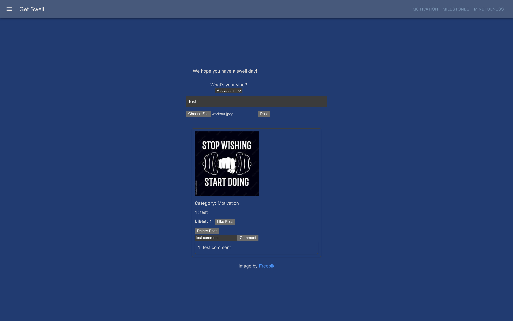
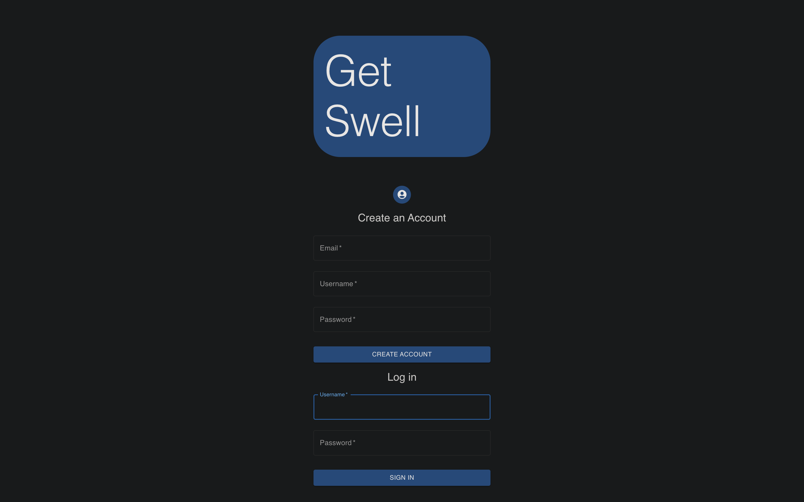
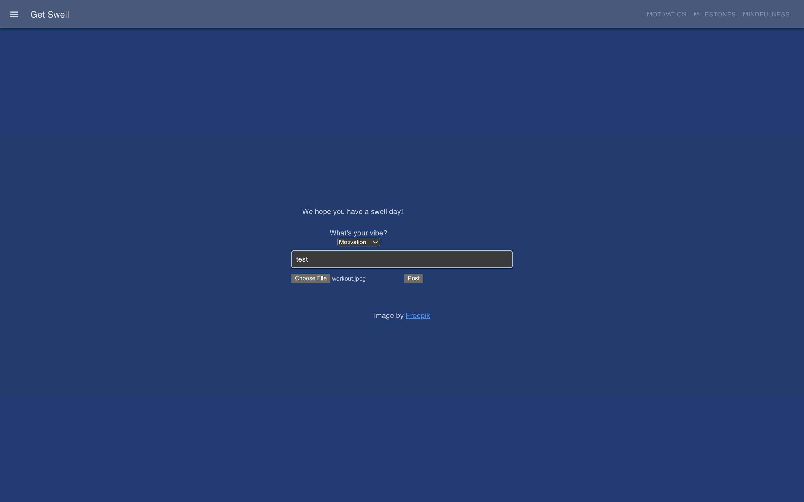
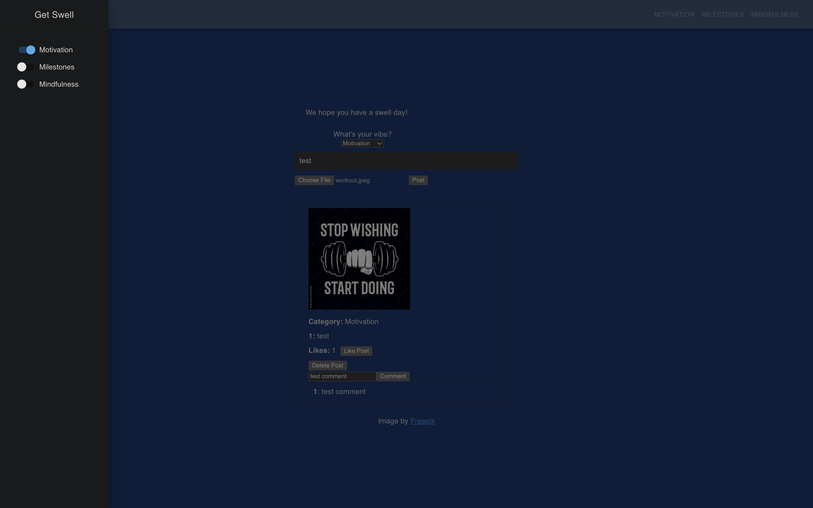

  

   
   
   
   
   
   
   
   
   
  

<h1 align="center">Get Swell 2.0</h1>

Get Swell is a fitness social media app that draws inspiration from Instagram, fostering connections among users to encourage and support each other in their fitness journeys. Unlike promoting extreme muscle gains, it focuses on promoting a positive and mindful approach to fitness. The app includes features such as cookie-based authentication, fundamental CRUD operations, and allows users to customize and filter their feed based on post types. Users can engage with posts in a manner reminiscent of interactions on Instagram.

## Table of Contents
- [Interface & Features](#interface--features)
- [What's New?](#whats-new)
- [Prerequisites](#prerequisites)
- [Usage](#usage)
- [For Future Iterations](#for-future-iterations)
- [The Get Swell 2.0 Team](#the-get-swell-20-team)

## Interface & Features

**Sign-Up/Login page**
- Users can create and log in to an account to make posts.

**Create Post feature**
- Users can fill out a form, pick a “vibe” of the photo, and insert a photo when creating a post online.

**Like or Comment**
- Each post has the ability to be liked or commented on, and each post is persisted in the database.

**Filter posts**
- Users can filter posts based on three “vibes” of Motivation, Milestones, and Mindfulness.

## What's New?

- Users are able to login, and create accounts.
- Each post can be filtered based off "vibes."
- Addition of cloudinary for hosting images.

## Prerequisites

To use Get Swell, you will need to:

- Create a MongoDB cluster and copy the URI.
- Find the `server/models/models.js` file and copy and replace the string on the 8th line with your URI.
- Head to the `server` directory and run `npm install`.
- Head to the `root` directory and run `npm install`.

## Usage

To use Get Swell effectively, follow these steps:

1. Create a split terminal, one for the `root` terminal (front-end), and one for the `server` terminal (back-end).

2. Run `npm run dev` in the root terminal and `npm run dev` in the server terminal.

3. The Login/Signup page should load, and if you do not already have an account, please sign up, or if you do, then log in.

  

4. You should be taken to the main page, and in the middle, there should be an option to make a post to your liking.

  

5. Once you make a post, the post should pop up along with the image and the ability to like or comment on each post.

  

6. There is also an additional feature when you hit the sliding window button on the top left that allows you to filter the specific posts you would like to see.

  

## For Future Iterations
- Looking to improve styling.
- Addition of a profile page.
- OAuthentication.
- Testing.

## The Get Swell 2.0 Team

Developed by:

- **Preston Mounivong**
  - LinkedIn: [Preston Mounivong](https://www.linkedin.com/in/prestonmounivong/)
  - GitHub: [prrrrreston](https://github.com/prrrrreston)

- **Justin Chu**
  - LinkedIn: [Justin Chu](https://www.linkedin.com/in/justin-chu-10a70a205/)
  - GitHub: [jchu47](https://github.com/jchu47)

- **Ayden Yip**
  - LinkedIn: [Ayden Yip](https://www.linkedin.com/in/aydenyip/)
  - GitHub: [aydenyipcs](https://github.com/aydenyipcs)

- **Sid Saxena**
  - LinkedIn: [Sid Saxena](https://www.linkedin.com/in/siddhantsaxena27/)
  - GitHub: [sidsaxena27](https://github.com/sidsaxena27)
